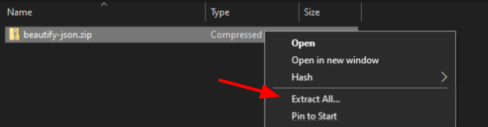

# JSONBeautifier

JSONBeautifier is a Chrome extension used for beautifing JSON code on the go. All you have to do is click the extension, and your code is highlighted and simplyified.

NOTE: The extension will only beautify code by getting the JSON code from the first &lt;pre&gt; element and replacing the whole page with the neater JSON code. The extension works best on pages where only JSON content is loaded.

### Installation

1. Download the ZIP file.

2. Unzip the file.

 - Windows:

   
 - Chrome OS:
   Open the zip, and copy a paste every thing into files.

3. Open [chrome extensions](chrome://extensions)

4. Turn on developer mode.

5. Click load unpacked. This will open your file explorer

6. Navigate to the unzipped folder.

7. Click the folder and click select folder in the bottom right.

8. That's it. Go to this [sample json](https://cookiegamer733.repl.co/sample-json) and click the extension and you should see the code change before your eyes.
